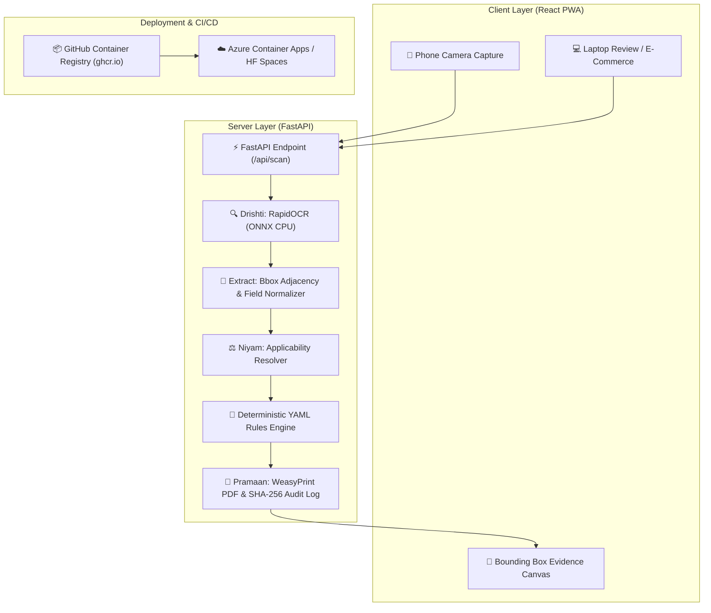

# Nirikshan — Legal Metrology Compliance Inspection Platform

[](https://github.com/rajputjay00/SIH-NIRIKSHAN/actions/workflows/ci.yml)
[](LICENSE)
[](https://python.org)
[](https://react.dev)

**Nirikshan** is an offline-capable, CPU-only, deterministic compliance inspection platform for pre-packaged commodities under the Legal Metrology (Packaged Commodities) Rules, 2011 (as amended). Designed for field inspectors, marketplace analysts, and manufacturers, Nirikshan uses open-weight ONNX OCR (RapidOCR), a rule applicability resolver, and a versioned rules-as-code engine to evaluate statutory declarations—including MRP format, SI units, Unit Sale Price arithmetic, letter height geometry, and country of origin—with court-admissible evidence overlays and bilingual PDF reports.

---

## 🌐 Live Deployment & QR Code

- **Live Platform URL**: [https://nirikshan.yellowsky-50e55bef.eastasia.azurecontainerapps.io](https://nirikshan.yellowsky-50e55bef.eastasia.azurecontainerapps.io)
- **Hugging Face Space**: [https://byyuvraj-nirikshan-api.hf.space](https://byyuvraj-nirikshan-api.hf.space)

| Mobile Phone Pairing QR | Live Azure App QR |
|:---:|:---:|
|  |  |

---

## 📋 Problem Statement & Ministry
- **Problem Statement ID**: **SIH26034**
- **Title**: Development of an AI/ML-based Tool for Verification of Mandatory Declarations on Pre-Packaged Commodities
- **Nodal Ministry**: Department of Consumer Affairs, Ministry of Consumer Affairs, Food and Public Distribution, Government of India.

---

## 📐 Architecture & Pipeline



---

## 📜 Rules Coverage

Nirikshan encodes the full Legal Metrology (Packaged Commodities) Rules, 2011 catalogue:

> **Total Rules Encoded**: **35** (**26** Implemented Engine Rules, **9** Planned M3 Rules)
> For detailed rule references, test fixtures, and verdict types, see [docs/RULES.md](docs/RULES.md).

---

## 🛠️ Technology Stack

- **Frontend**: React 18, Vite, Framer Motion, Lucide Icons, Vite PWA, CSS Modules (No Tailwind / No UI component library).
- **Design Tokens**: Standardized CSS variables (`frontend/src/styles/tokens.css`) following official brand guidelines.
- **Backend**: Python 3.12, FastAPI, Pydantic v2, PyYAML, WeasyPrint, OpenCV.
- **OCR Engine**: RapidOCR (`rapidocr_onnxruntime`) with ONNX Runtime CPU execution provider.
- **Containerization**: Single multi-stage Docker container (built via GitHub Actions GHA cache and pushed to GHCR).

---

## 🚀 Run Locally

### 1. Prerequisites
- Python 3.12+
- Node.js 20+

### 2. Backend Setup
```bash
# Create and activate Python virtual environment
python -m venv venv
# On Windows:
venv\Scripts\activate
# On Linux/macOS:
source venv/bin/activate

# Install dependencies
pip install -r backend/requirements.txt -r backend/requirements-dev.txt

# Run backend development server
uvicorn backend.main:app --reload --port 8000
```

### 3. Frontend Setup
```bash
cd frontend
npm install
npm run dev
```
Open `http://localhost:5173` in your browser.

---

## 🐳 Run with Docker

Run the production container locally:

```bash
# Build Docker image
docker build -t nirikshan:local .

# Run container on port 7860
docker run -p 7860:7860 nirikshan:local
```
Access the application at `http://localhost:7860`.

---

## 🧪 Testing & Verification

```bash
# Run backend test suite (pytest)
pytest backend/tests/

# Check rules documentation consistency
python scripts/make_rules_table.py --check

# Run frontend bbox mapping tests
node frontend/src/utils/test_bbox.js

# Run frontend vitest suite
cd frontend && npx vitest run
```

---

## ⚖️ Licence

Distributed under the **Apache-2.0 License**. See [LICENSE](LICENSE) for details.
